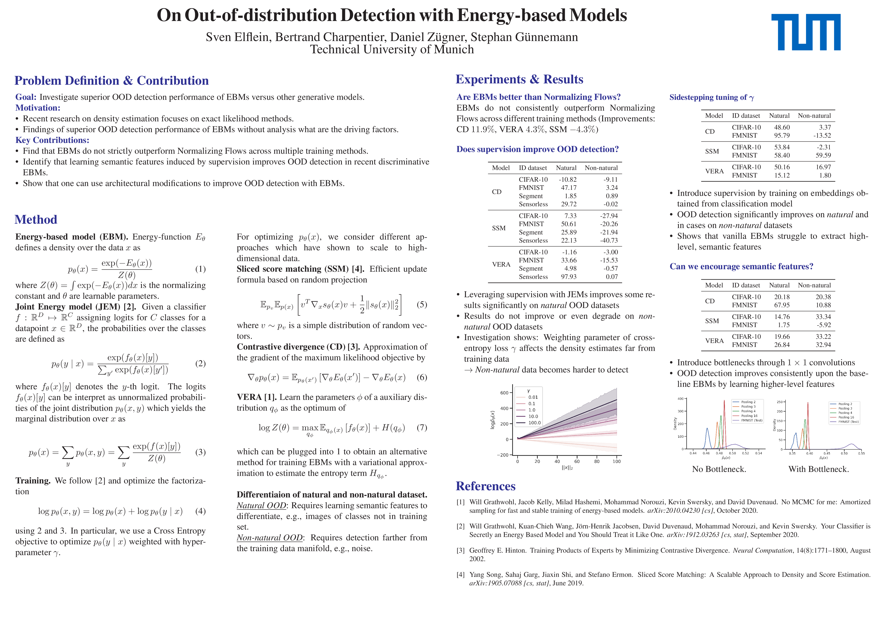

# LaTex Poster for "On Out-of-distribution Detection with Energy-based Models"

> [On Out-of-distribution Detection with Energy-based Models]() \
Sven Elflein, Bertrand Charpentier, Daniel Zügner, Stephan Günnemann \
ICML 2021, Workshop on Uncertainty & Robustness in Deep Learning.

      

## Acknowledgments

Based on https://github.com/guanyingc/TOM-Net_Poster_LaTex.